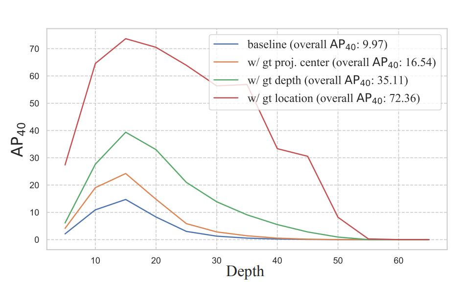
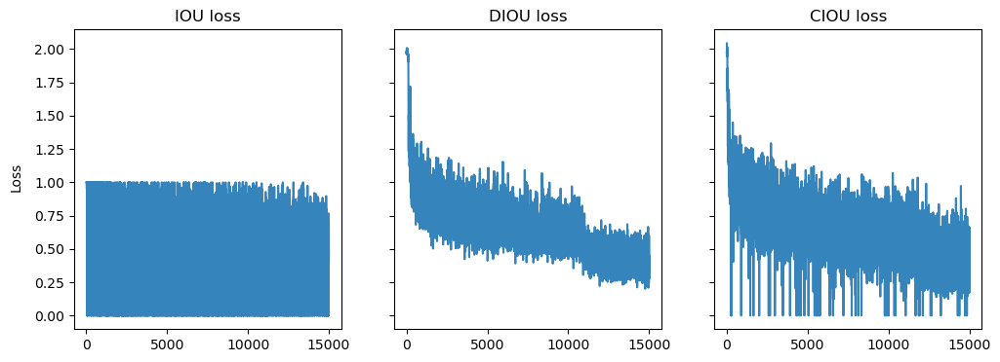
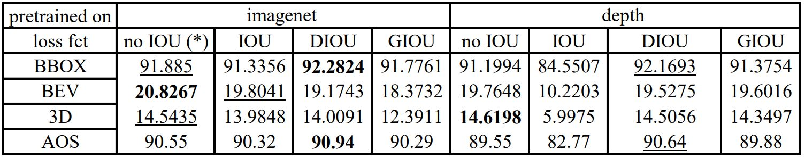

# DLAV-3DLOC
Project on 3D vehicle localization for the course Deep Learning for Autonomous Vehicles, made as part of the ["Deep Learning for Autonomous Vehicle"](https://edu.epfl.ch/coursebook/en/deep-learning-for-autonomous-vehicles-CIVIL-459) course from Pr. Alahi.  

<a href="https://www.tri.global/" target="_blank">
 
</a>

- [Introduction](#introduction)
- [Contribution Overview](#contribution-overview)
- [Dataset details](#dataset-details)
- [Experimental Setup](#dataset-stats)
- [How to use](#how-to-use)
- [Results](#evaluation-metrics)
- [Conclusion](#ipython-notebook)
- [References](#references)


## Introduction

In this project, we aim to train a model to perform 3D car detection from RGB images. The ultimate goal is to integrate this module into other components in order to build an autonomous road planning algorithm.

xxx: gif de notre algo qui fonctionne. 

## Contribution Overview
From the paper "Investigating Localization Errors in Monocular 3D Object Detection," following diagnostic experiments, the research team inferred that the most significant potential for performance enhancement lies within the realms of 3d localization and depth estimation.




We aimed to pursue this direction further, exploring multiple possibilities:

Our primary objective involved improving depth prediction, a major challenge faced by 3D detection models without LiDAR. 
In fact, based on the curve in Figure 1, there is a notable potential increase in Average Precision (AP) score from the baseline to achieving perfect depth prediction. 
In "DD3D: Is Pseudo-Lidar essential for Monocular 3D Object Detection?", employing pre-trained models on a large-scale depth LiDAR dataset resulted in enhanced localization performance.
Specifically, we utilized a DLA-34 backbone pretrained through self-supervised learning on the [DDAD15](https://github.com/TRI-ML/DDAD) dataset. 
Initially, the backbone was pretrained on ImageNet, augmenting the model's classification ability. Our objective is to provide depth mapping to the neck and head of our model.

Our secondary objective focused on enhancing localization prediction. 
Notably, from the curve above, we observed that the largest potential improvement in AP score lies in localization performance.
Upon analyzing our model, we discovered that the 3D loss solely captured its dimensions, without considering factors such as intersection over union (IOU). 
After implementing ourselves a simple IOU, we identified the presence of noise in our loss function and addressed it by introducing a distance notion to attract predicted boxes towards the ground truth boxes.
To ensure well-shaped boxes, we also incorporated an aspect loss along with the IOU loss. 
To gain a better understanding of the impact of each loss function, we plotted loss curves and obtained corresponding scores to demonstrate the utility of each loss.
The different IOU losses are detailed in the [Zheng et al.](https://arxiv.org/pdf/2005.03572.pdf) paper. 

## Experimental Setup
- First, we tested the baseline model from the paper in order to retrieve the scores on the same validation set.
- Then, we loaded the depth pre-trained weights in the DLA-34 backbone, re-trained on the kitti dataset and observed the results.
- We also implemented the IOU loss and noted that the loss was noisy and was not going down.
- We suggested that adding a distance notion (IOU->DIOU) would add slope to the loss and enhance training.
- We tried to outperform this new DIOU loss by adding an aspect loss (DIOU->GIOU), penalising the box dimensions prediction error only if the IOU>0,5. 

To quantify the performance of our predictions, we used the known kitti metrics: 
- BEV (Bird's Eye View) AP: The BEV AP metric evaluates the average precision of object detection in the bird's eye view projection. It measures the accuracy of detecting objects in the top-down view of the scene.

- BBOX AP: The BBOX AP metric calculates the average precision of object detection in 2D bounding boxes. It measures the accuracy of localizing objects in the image plane.

- 3D AP: The 3D AP metric assesses the average precision of object detection in 3D space. It evaluates the accuracy of localizing objects in terms of their 3D position, size, and orientation.

- AOS (Orientation Similarity) AP: The AOS AP metric measures the average precision of object detection based on the similarity of predicted and ground truth object orientations. It specifically evaluates the accuracy of estimating object orientations

## Dataset details
The 3D object detection benchmark consists of 7481 training images and 7518 test images, comprising a total of 80.256 labeled objects. 
Training RGB images are paired with label txt files. A label file is build with multiple lines, that is made following this structure (from kitti [readme](https://github.com/bostondiditeam/kitti/blob/master/resources/devkit_object/readme.txt)): 
|Values  |  Name  |    Description|
|--------|--------|---------------|
|   1    | type   |     Describes the type of object. |
|   1    | truncated |   Float where truncated refers to the object leaving image boundaries. |
|   1    | occluded  |   Integer indicating occlusion state. |
|   1    | alpha     |   Observation angle of object. |
|   4    | bbox      |   2D bounding box of object in the image. |
|   3    | dimensions |  3D object dimensions: height, width, length (in meters). |
|   3    | location   |  3D object location x,y,z in camera coordinates (in meters) |
|   1    | rotation_y |  Rotation ry around Y-axis in camera coordinates. |
|   1    | score      |  Only for results: confidence in detection, needed for p/r curves. |

While the calib folder, contains the calibration of the camera for each RGB image. Since we use left RGB images, we only use the `P2` camera matrix.
From this matrix, can be retrieved the intrinsic and extrinsic parameters of the camera: 

|f_u|f_v|c_u|c_v|t_x|t_y|
|---|---|---|---|---|---|
|P2[0,0]|P2[1,1]|P2[0,2]|P2[1,2]|-P2[0,3]/f_u|-P2[1,3]/f_v|


## How to use
### Environment setup
This repo is tested on our local environment (python=3.7.7, cuda=11.1, pytorch=1.13), and we recommend you to use anaconda to create a virtual environment:
Adapt python version, and pytorch installation version depending on your cuda version. Check with `nvidia-smi`. 

```bash
conda create -n monodle python=3.7.7
```
Then, activate the environment:
```bash
conda activate monodle
```

Install  Install PyTorch (1.10.1 in our case):

```bash
pip install torch==1.10.1+cu111 torchvision==0.11.2+cu111 torchaudio==0.10.1 -f https://download.pytorch.org/whl/cu111/torch_stable.html
```

and other  requirements:
```bash
pip install -r requirements.txt
```

### Dataset Location
Please download [KITTI dataset](http://www.cvlibs.net/datasets/kitti/eval_object.php?obj_benchmark=3d) and organize the data as follows:

```
#ROOT
  |data/
    |KITTI/
      |ImageSets/ [already provided in this repo]
      |object/			
        |training/
          |calib/
          |image_2/
          |label/
        |testing/
          |calib/
          |image_2/
```


## Results
First, from our runs, we've plotted the different IOU losses and analysed them. 

- The simple IOU loss function does not weaken. It doesn't lose variance either, giving losses at 1 and zero even at the end of training. The model has therefore not learned from this loss function.  
- To give a slope to the loss function, we add a normalized distance between the boxes. This has the great effect of reducing the loss function, bounding it with a lower value and variance at the end of the training. The model seems to have learnt from this loss function.
- Adding the aspect ratio, gives the model more variance, making the learning more difficult.
- In general, losses seems to still be able to reduce more. 

We then analysed the different models and loss functions, combined in different configurations. To measure performance, we used the kitti metrics described above. 


- The DIOU loss function, added to the baseline model, beat the other models with respect to BEV and 2D bounding box prediction scores.
- The pretrained backbone, loaded in the baseline model, beat the others models at 3D box prediction score, which is the most important score, and is the one noted in the original paper. This is the proof that improving depth estimation is the most efficient way of enhancing 3D AP. On the other hand, all the other metrics are lowered. 
- A good compromise is to use the model with pretrained backbone, and the DIOU loss. This model still achieves close results in 3D AP as the baseline, and beat the baseline on 2D bounding box and Orientation APs. 
- If we would be ranked on the [Monocular 3D Object Detection on KITTI Cars Moderate](https://paperswithcode.com/sota/monocular-3d-object-detection-on-kitti-cars), we would be 4th. 

### Checkpoints 
You can retrieve the different checkpoints for each experiment on the following [Google Drive](https://drive.google.com/drive/folders/1sO54olD8GK0d1BrigqETHf8zpZpr84WS?usp=sharing)

## Conclusion

In conclusion, we improved the performance of our baseline model, particularly on BBOX and AOS scores, while preserving our performance on 3D prediction.  This was achieved by adding an IOU loss function including distance, and using a backbone pre-trained on lidar and RGB pairs. 
We believe that the results obtained can be improved with longer training runs, which is perhaps how we'll see the effect of the IOU. 

## References

This repo benefits from the excellent work from [Monodle](https://github.com/xingyizhou/CenterNet). We also benefited from the [DD3D](https://github.com/TRI-ML/dd3d) pre-trained DLA weights. Finally, the IOU losses were inspired from [Zheng et al.](https://arxiv.org/pdf/2005.03572.pdf). 

